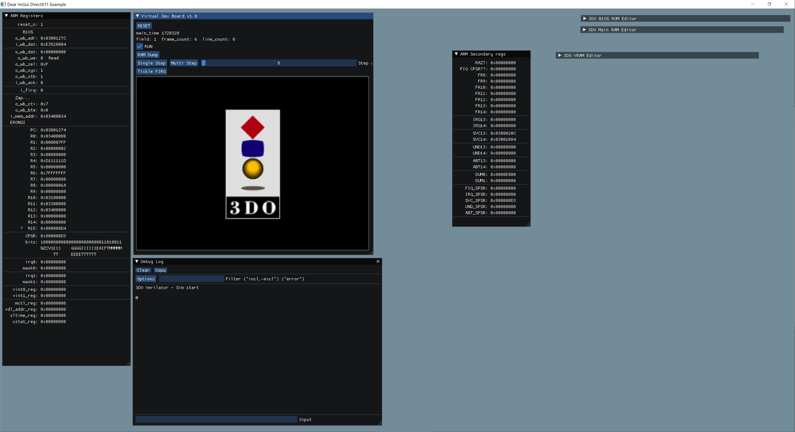

# sim_3do

Zap ARMv5T core by Revanth Kamaraj, from opencores.com

Verilator by Wilson Snyder.

Dear Imgui library by Omar (ocornut).

I used Microsoft Visual Studio 2019, version 16.4.5 (the free version), to build the sim project.

This is very early work on an FPGA core for the 3DO console.

The Zap CPU has started booting some BIOS code, but it's not getting very far yet before crashing.

'fixel' and 'trapexit' have been helping me a lot (on The 3DO Community Discord).

fixel helped patch the Zap core, to handle byte reads/writes properly.
(the ARM60 used on the 3DO is set to Big Endian mode, via a pin tied High on the motherboard. The Zap core originally only supported little endian.)

trapexit helped me get the Opera 3DO emulator compiling under MSVC, so I can compare trace logs to the Verilator sim version.
(I might make a new repo for the Opera MSVC project, but there are tons of files, and it will take some time to figure out.)

Everything else (registers, DRAM, VRAM) is all emulated in C right now.

I was able to display the 3DO logo by parsing the CLUT (Color Look-Up Table), but only by using a VRAM dump from the MAME debugger (ie. "cheating")
But that confirmed that I was able to decode the logo image correctly...

The 3DO BIOS isn't booting far enough to copy the logo into VRAM yet.

Most of the registers for MADAM are in place already, but very little logic is written for them.

I've started putting the CLIO registers in Verilog.

ElectronAsh.
