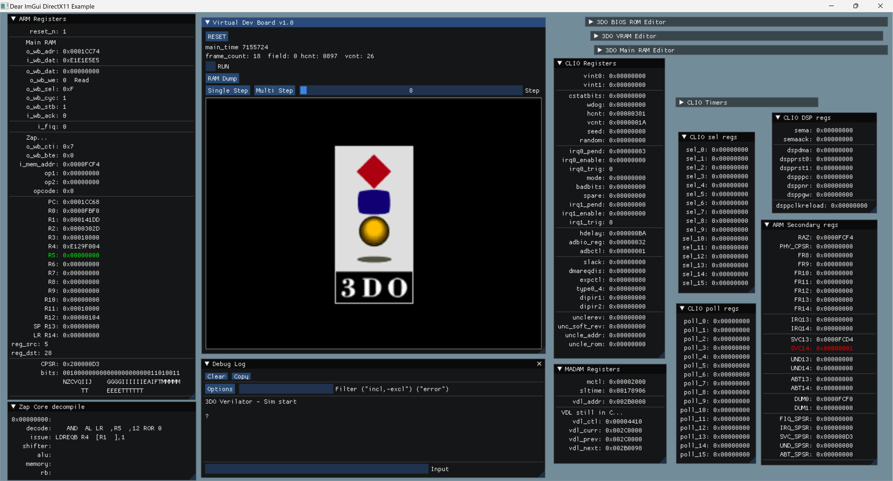

# WIP 3DO FPGA core, by ElectronAsh and Revanth. 

:+1:Zap ARMv5T core by Revanth Kamaraj, from opencores.com

:+1:Verilator by Wilson Snyder.

:+1:Dear Imgui library by Omar (ocornut).

This is now a joint effort between ElectronAsh and Revanth.

(Revanth wrote the Zap ARM CPU core, which has high complexity, and currently represents the bulk of the core logic.)

I run Verilator from within WSL2 / Ubuntu, to "compile" the Verilog into the C/C++ sim model.

Your version of Verilator needs to be the same (or close) version to what I used.
I'm currently using v5.002-117-g31d8b4cb8, installed by compiling the Verilator source, then sudo make install, etc.

Every time a change is made to the Verilog, verilator needs to be run again before running the sim from within MSVC.
(I know it's possible to have MSVC run a WSL command, and that verilator can be compiled for Windows, but I find WSL good enough for most of this.)

I'm now using Microsoft Visual Studio 2022, version 17.4.2 (the free version) to build and run the sim.

This is very early work on an FPGA core for the 3DO console.
The Zap CPU has started booting some BIOS code, but it's not getting very far yet before crashing.

I'm using the latest commit of the Zap CPU before the author changed it to (mainly) SystemVerilog.
I tried many times to get the very latest SV version to work, but it crashes within the first handful of instructions.
Whereas the older Verilog-only version does at least "boot" far enough to show the 3DO logo.

EDIT: I'm now using the very latest SystemVerilog version of the Zap ARM core.
The main issue getting it running was because I was immediately setting the i_wb_ack signal in the C code high, as soon as I saw o_wb_stb go high.
So the Verilator model was seeing the ack signal go high on the very same "clock" cycle, which was wrong.

The SystemVerilog version of Zap is now booting to the 3DO logo, and no longer showing the "SWI Overrun" error in the 3DO BIOS.
But it is now "boot looping" after about every 18 frames. I think this is good progress though, as it's now using the very latest Zap, MSVC 2022, and Verilator.
(and presumably the latest version of Dear Imgui, from the imgui repo.) 

:+1: Revanth (the author of the Zap ARM core) has now installed sim_3do, and is looking to help with the core. ;)

:+1:'fixel' and 'trapexit' have been helping me a lot (on The 3DO Community Discord).

fixel helped patch the Zap core, to handle byte reads/writes properly.
(the ARM60 used on the 3DO is set to Big Endian mode, via a pin tied High on the motherboard. The Zap core originally only supported little endian, IIRC)

trapexit helped me get the Opera 3DO emulator compiling under MSVC, so I can compare trace logs to the Verilator sim version.
(I might make a new repo for the Opera MSVC project, but there are tons of files, and it will take some time to figure out.)

Everything else (BIOS, DRAM, VRAM, framebuffer) are all still emulated in C right now.
(I've started moving more of the registers from C to Verilog. Some of the logic is still being handled in C.)

The BIOS is now booting far enough to copy the 3DO logo into VRAM as it's supposed to.
(before I was "cheating", by using a VRAM dump from MAME.)

Displaying the logo is still handled in the sim_main C code, though.
The C code is parsing the VDL header, and loading the CLUT (palette), so the logo displays correctly.

I added some code which highlights the source register in Green, and the destination register in Red.
That is only valid when the instruction is in the decode stage of the pipeline (see the lower-left window)...

Most of the registers for MADAM are in place already, but very little logic is written for them.

I've started putting the CLIO registers in Verilog.
Almost no other logic exists in CLIO either atm, aside from the counters for hcnt/vcnt, and some basic Interupt (FIQ) logic.

ElectronAsh.
